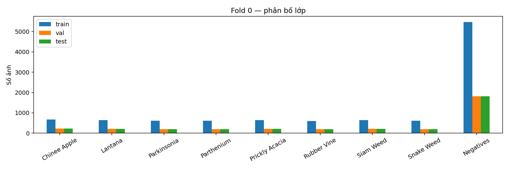
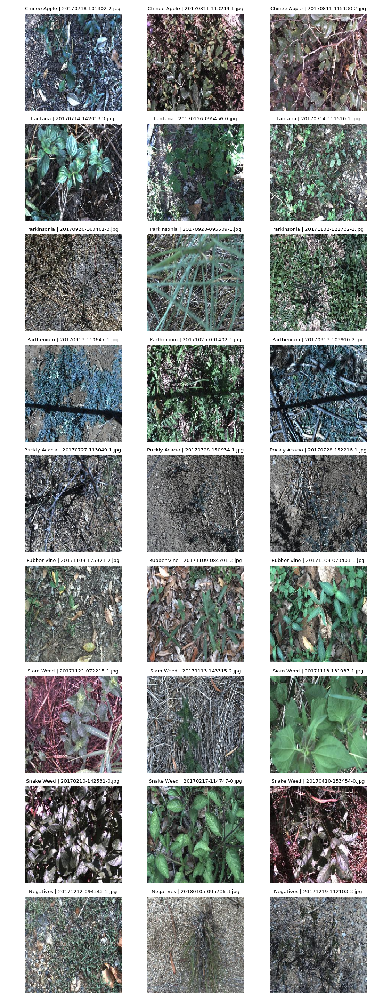
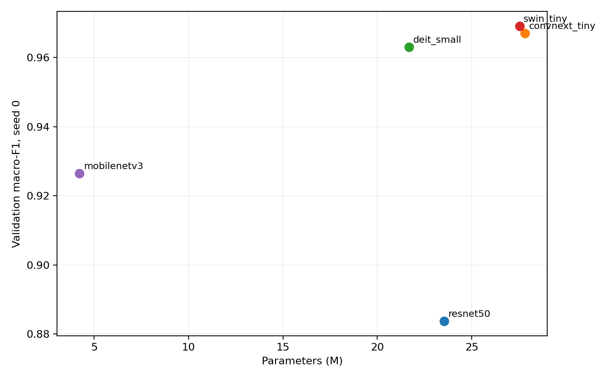
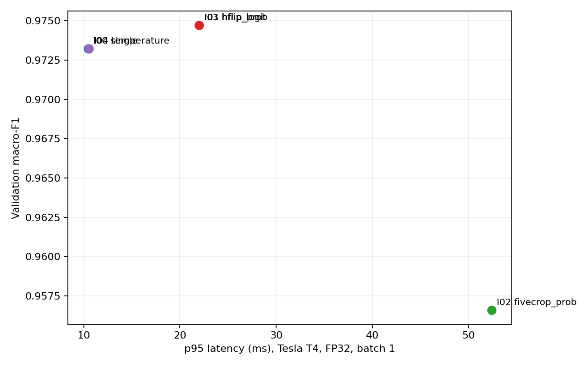
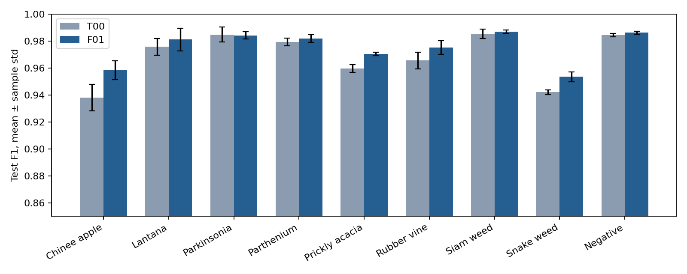
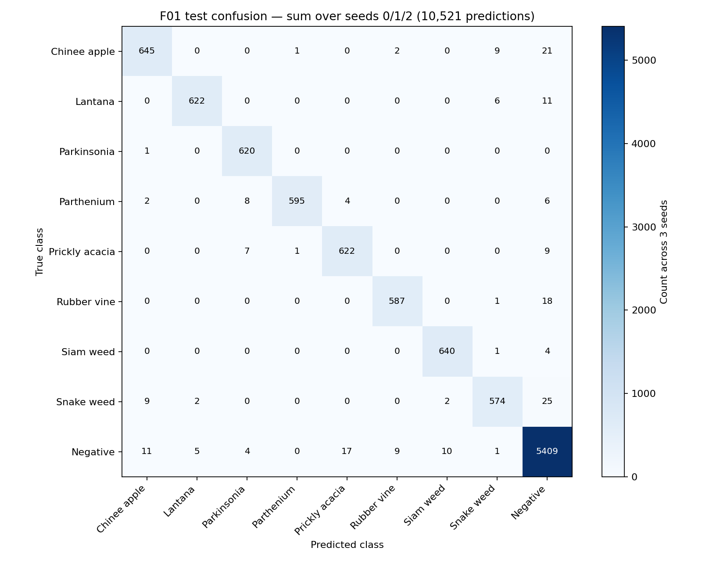
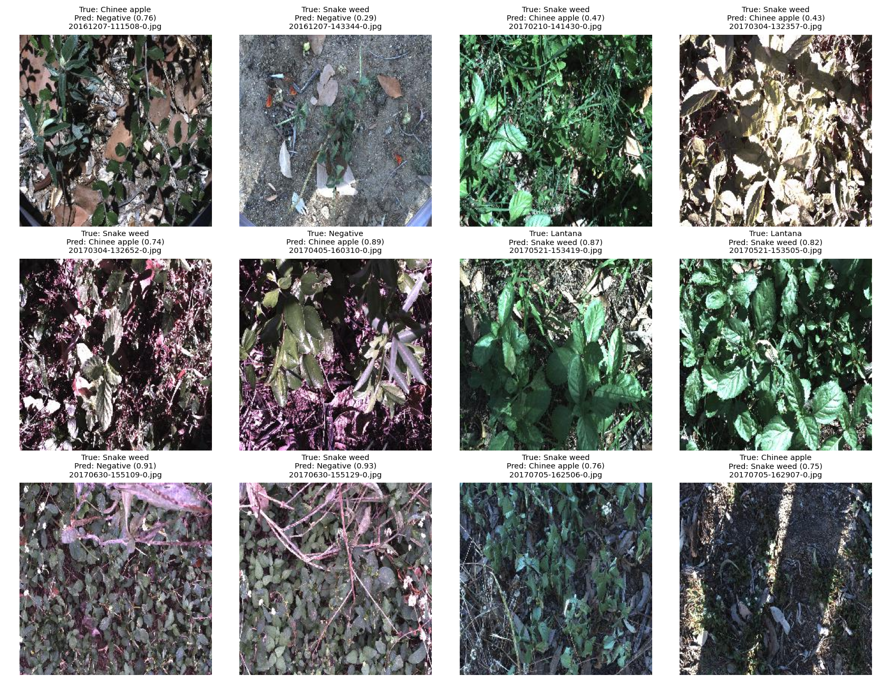
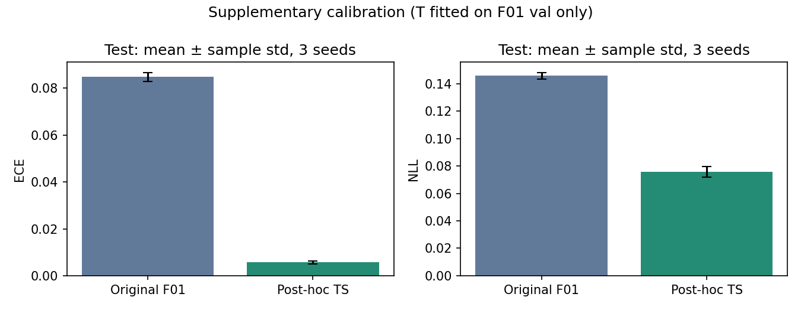
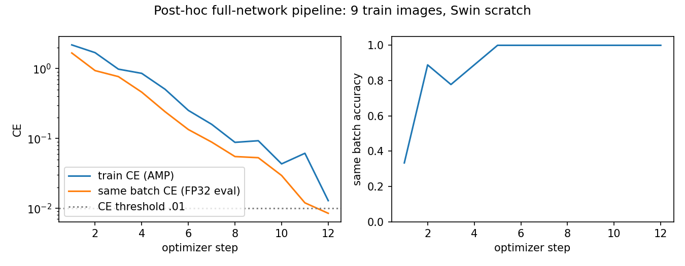

# Báo cáo Lab Day 2 — DeepWeeds

**Phạm Văn Kiên · 2A202602590 · Track 4**  
Notebook: [https://www.kaggle.com/code/b22dckh063phmvnkin/track4-d2](https://www.kaggle.com/code/b22dckh063phmvnkin/track4-d2) · Nguồn số liệu: `results.zip` do sinh viên cung cấp; kiểm tra lại ngày 05/10/2026.

## 1. Tóm tắt

Phân loại 9 lớp DeepWeeds trên fold 0 cố định, chọn cấu hình bằng macro-F1 validation. Đã chạy 5 backbone, 9 biến thể huấn luyện ngoài mốc và 5 phương pháp suy luận. Cấu hình cuối Swin Tiny + label smoothing 0,1 + CutMix + hflip-logit đạt **accuracy 98.0325% ± 0.0855 điểm phần trăm**, **macro-F1 0.97528 ± 0.00094** trên test qua 3 seed. So với mốc, macro-F1 tăng 0.00696, nhưng ECE tăng từ 0.01813 lên 0.08477; cải thiện phân loại không đồng nghĩa cải thiện độ tin cậy. Các kết luận quét sàng chỉ dựa trên một seed. Độ trễ final p95 đo bổ sung trên RTX 2050 là 22.41 ms, chưa gồm đọc ảnh và tiền xử lý ban đầu.

## 2. Dữ liệu và thiết lập

17.509 ảnh JPG RGB, tất cả 256×256; kiểm tra giải mã không có ảnh hỏng. MD5 images.zip: `b7b30f96d466fba86016aa5a26606e0f`. Split train/val/test = 10.501/3.501/3.507, không giao nhau theo tên file, hợp đủ tập ảnh. Negative chiếm 52.01% toàn bộ; tỷ lệ lớp lớn nhất/nhỏ nhất 9.025. Vì mất cân bằng, macro-F1 (9 lớp) là chỉ số chọn chính; top1, balanced accuracy, ECE 15 bin và NLL là chỉ số bổ sung.

| Lớp | Train | Val | Test |
|---|---|---|---|
| Chinee apple | 675 | 225 | 226 |
| Lantana | 637 | 213 | 213 |
| Parkinsonia | 618 | 206 | 207 |
| Parthenium | 613 | 204 | 205 |
| Prickly acacia | 637 | 212 | 213 |
| Rubber vine | 605 | 202 | 202 |
| Siam weed | 644 | 215 | 215 |
| Snake weed | 609 | 203 | 204 |
| Negative | 5463 | 1821 | 1822 |

Có một khác biệt nhãn trong dữ liệu gốc: `20170714-110407-3.jpg` là Lantana (1) ở labels.csv nhưng Chinee apple (0) ở train_subset0.csv. Giữ nguyên CSV; huấn luyện dùng nhãn split. Đây là hạn chế dữ liệu, không tự sửa nhãn sau khi xem test. Negative chứa nền/thảm thực vật đa dạng, còn các lớp cây có nhiều lá xanh và bối cảnh tương tự, nên cần xét lỗi theo từng lớp.

Công thức nền: đầu vào224, train RandomResizedCrop + hflip, val resize/center crop, chuẩn hóa ImageNet; AdamW lr backbone1e-4/head1e-3, weight decay0,05, 12 epoch, batch 32, warmup1 epoch rồi cosine tới0,01×lr, grad clip1; CE, không mix/EMA, AMP khi train và FP32 khi eval. Seed0 cho quét sàng; seed0/1/2 cho T00 và F01, std mẫu ddof=1. `deterministic=False`: cố định seed không đảm bảo kết quả bitwise. GPU Kaggle Tesla T4; môi trường gốc ghi trong `evidence/runs/environment.json` ({"python": "3.13.15", "torch": "2.11.0+cu128", "timm": "1.0.29", "pandas": "2.3.3", "profile": "kaggle", "seeds": [0, 1, 2], "gpu": "Tesla T4"}).

Kiểm tra bổ sung sau thực nghiệm, chỉ dùng 18 ảnh train: CE khởi tạo Swin scratch2,2132 gần ln(9)=2,1972; classifier trên đặc trưng backbone đóng băng đạt CE0,000994 sau45 bước. Đây là kiểm tra head/nhãn bổ sung, **không chứng minh đã overfit toàn pipeline trước lần train Kaggle**. Ảnh augmentation và trace nằm ở `curves/supplementary/`, cấu hình ở `evidence/supplementary/pipeline_posthoc.json`.

## 3. So sánh backbone

| ID | Backbone / weights | M params | GMAC hooks | F1 val | Top1 val | s/epoch | p95 ms RTX2050 |
|---|---|---|---|---|---|---|---|
| B01 | resnet50 / a1_in1k | 23.526 | 4.087 | 0.88380 | 0.91117 | 62.09 | 8.74 |
| B02 | convnext_tiny / in12k_ft_in1k | 27.827 | 4.455 | 0.96706 | 0.97429 | 53.67 | 9.30 |
| B03 | deit_small / fb_in1k | 21.669 | 4.241 | 0.96303 | 0.97115 | 34.55 | 6.60 |
| B04 | swin_tiny / ms_in1k | 27.526 | 4.350 | 0.96906 | 0.97686 | 66.20 | 16.97 |
| B05 | mobilenetv3 / ra_in1k | 4.214 | 0.215 | 0.92649 | 0.94430 | 30.10 | 8.95 |

Swin Tiny đạt F1 cao nhất0,96906, hơn ConvNeXt0,00200 và DeiT0,00603 trên seed0. Khoảng cách Swin–ConvNeXt nhỏ hơn std mốc test0,00342 (tham chiếu nhiễu, không phải std riêng hai backbone); chưa đủ dữ liệu để khẳng định ưu thế ổn định. ResNet50 thấp hơn rõ trong công thức/ngân sách này; không suy ra mọi công thức ResNet đều kém. ConvNeXt dùng `in12k_ft_in1k`, các backbone khác trọng số In1k; do khác dữ liệu tiền huấn luyện, không quy toàn bộ chênh lệch cho kiến trúc. GMAC bằng hook Conv2d+Linear, **bỏ qua attention matmul**, không phải FLOPs toàn mô hình. Latency backbone đo bổ sung cùng RTX2050, không so trực tiếp với T4.

## 4. Công thức huấn luyện

| ID | Trục / thay đổi | F1 val | Δ với T00 | F1 Chinee | F1 Snake |
|---|---|---|---|---|---|
| T00 | mốc: finetune/basic/CE/single | 0.96906 | +0.00000 | 0.95768 | 0.93564 |
| T01 | A: scratch | 0.74584 | -0.22322 | 0.59564 | 0.65940 |
| T02 | A: frozen backbone | 0.83721 | -0.13185 | 0.76145 | 0.74394 |
| T03 | B: TrivialAugmentWide | 0.95939 | -0.00967 | 0.93665 | 0.91729 |
| T04 | B: color jitter | 0.96700 | -0.00207 | 0.93304 | 0.92910 |
| T05 | C: label smoothing 0.1 | 0.97196 | +0.00290 | 0.95111 | 0.93333 |
| T06 | C: focal gamma 2 | 0.96811 | -0.00095 | 0.94595 | 0.93137 |
| T07 | D: CutMix alpha 1 | 0.97150 | +0.00244 | 0.94690 | 0.92040 |
| T08 | D: Mixup alpha 0.2 | 0.97031 | +0.00125 | 0.94298 | 0.92574 |
| T09 | C+D: label smoothing 0.1 + CutMix alpha 1 | 0.97321 | +0.00415 | 0.95516 | 0.94059 |

T01/T02 chỉ đổi cách khởi tạo/đóng băng; T03/T04 đổi augmentation; T05/T06 đổi loss; T07/T08 đổi mix. T09 kết hợp hai yếu tố tốt nhất trên val, là kiểm tra tương tác chứ không phải ablation một yếu tố. Scratch0,74584 và frozen0,83721 kém finetune0,96906: trong12 epoch, tiền huấn luyện cộng tinh chỉnh có tác dụng lớn. Không có đối chứng CNN scratch nên chưa kết luận ViT scratch kém CNN scratch.

Label smoothing tăng0,00290, CutMix tăng0,00244; T09 tăng0,00415, nhỏ hơn tổng hai tăng riêng0,00533: hiệu ứng không cộng tuyến tính ở seed0. Focal giảm0,00095, color jitter giảm0,00207; chênh nhỏ chưa thể phân biệt ổn định. TrivialAugment giảm0,00967 ở cấu hình này: biến đổi mạnh có thể làm mất đặc điểm loài, đây là giả thuyết chứ chưa có kiểm chứng nhân quả. Với vật thể nhỏ, CutMix cũng có nguy cơ cắt mất cây; kết quả seed0 không đảm bảo áp dụng mọi ảnh. Không có std nhiều seed cho T01–T09; không dùng std T00 để thay thế kiểm định từng ablation.

Mỗi run có loss train/val và F1 theo epoch trong20 ảnh riêng `curves/`; cấu hình, log12 epoch và summary ở `evidence/runs/<ID>/seed<k>/`. Curve F01 là single-view lúc train; summary/prediction F01 val là hflip-logit sau lựa chọn, nên các F1 không nhất thiết bằng nhau.

## 5. Suy luận và hiệu chuẩn

Tất cả phương pháp dùng cùng checkpoint T09 seed0, chỉ đánh giá val.

| ID / method | K | F1 val | ECE val | p50/p95/p99 ms (T4) | Chi phí |
|---|---|---|---|---|---|
| I00 single | 1 | 0.97321 | 0.08330 | 9.84/10.46/11.49 | 1.00× |
| I01 hflip_prob | 2 | 0.97471 | 0.08253 | 20.46/22.00/23.14 | 2.08× |
| I02 fivecrop_prob | 5 | 0.95661 | 0.07738 | 50.08/52.40/53.34 | 5.09× |
| I03 hflip_logit | 2 | 0.97471 | 0.08250 | 21.10/21.97/22.19 | 2.14× |
| I04 temperature | 1 | 0.97321 | 0.00590 | 10.04/10.56/11.83 | 1.02× |

Hflip tăng F1 từ0,97321 lên0,97471 (+0,00150), p95 gần2,10×. Hflip-prob và hflip-logit có cùng F1; runner dùng ECE rồi độ trễ để phá hòa, chọn logit. Fivecrop (crop7/8 tensor rồi resize224) giảm F10,01661, p95≈5×: crop có thể mất vật thể/bối cảnh và lệch phân phối; không coi TTA luôn có lợi. Temperature scaling T=0,63802 giảm ECE val từ0,08330 xuống0,00590, giữ nguyên argmax/F1. T được khớp và đo trên cùng val nên đây không phải hiệu chuẩn đánh giá độc lập. I04 áp dụng single-view, **không áp T này vào F01 hflip-logit**; ở lần chạy gốc chưa có test trước/sau TS của final; phần6.1 bổ sung phân tích F01_TS từ CSV đã lưu.

Đo T4 FP32 batch 1, warmup 10,50 lần, CUDA synchronize, eval/inference_mode; gồm tạo view tensor+forward+aggregation, không gồm decode/resize/normalize đầu vào và I/O. Ảnh/s trong workbook=1000/p50 batch 1, không phải throughput batch 32. 

Đo bổ sung ngày05/10/2026 trên checkpoint gốc, đầu vào tensor ngẫu nhiên32×3×224×224, FP32, warmup 10/n 50, CUDA đồng bộ, eval/inference_mode; không đọc tập test. p95 dưới đây là thời gian **cả batch 32**, không phải độ trễ từng ảnh. Thông lượng=32.000/thời gian batch trung bình (ms); không so trực tiếp với T4.

| Cấu hình | GPU | Batch | p95 batch (ms) | Thông lượng (ảnh/s) |
|---|---|---|---|---|
| I00 (T09, single) | RTX 2050 | 32 | 241.27 | 133.06 |
| I01 (T09, hflip_prob) | RTX 2050 | 32 | 483.44 | 66.41 |
| I02 (T09, fivecrop_prob) | RTX 2050 | 32 | 1209.14 | 26.51 |
| I03 (T09, hflip_logit) | RTX 2050 | 32 | 484.15 | 66.30 |
| I04 (T09, temperature) | RTX 2050 | 32 | 242.46 | 132.56 |
| F01 (F01, hflip_logit) | RTX 2050 | 32 | 483.94 | 66.30 |

Phiên bản môi trường đo bổ sung: {"python": "3.14.5", "torch": "2.12.0+cu126", "timm": "1.0.30"}.

## 6. Cấu hình cuối và phân tích lỗi

F01: `swin_tiny_patch4_window7_224.ms_in1k`, 9 lớp, finetune toàn mạng; baseline optimizer/scheduler như mục2; basic augmentation, label smoothing0,1 + CutMix alpha1,0, không EMA; checkpoint có F1 val cao nhất; suy luận hflip-logit2 view ở224, FP32, T=1. Ba seed0/1/2. T00 mốc là cùng Swin/basic/CE, single-view. Runner lưu lựa chọn/seed và dấu vết thực nghiệm trước final trong `evidence/runs/`; các số dưới tính lại từ CSV gốc, không forward test bổ sung.

| Cấu hình | F1 val | F1 test | Top1 test | Balanced acc test | ECE test |
|---|---|---|---|---|---|
| T00 | 0.97013 ± 0.00163 | 0.96832 ± 0.00342 | 0.97567 ± 0.00194 | 0.96653 ± 0.00152 | 0.01813 ± 0.00155 |
| F01 | 0.97533 ± 0.00092 | 0.97528 ± 0.00094 | 0.98033 ± 0.00086 | 0.97248 ± 0.00133 | 0.08477 ± 0.00192 |

ΔF1=0.00696, lớn hơn max(std final, std mốc)=0.00342. Đây là cải thiện vượt thước đo nhiễu mô tả của rubric; ba seed không đủ cho kết luận thống kê mạnh. Khoảng cách val–test final=0.000047, không dùng kết quả này để sửa recipe. ECE final cao hơn mốc, NLL final 0.14585 so với 0.14165; nếu cần xác suất đáng tin, phải hiệu chuẩn chính phương pháp final trên validation riêng trong thực nghiệm tương lai.

| Lớp | n test | Recall mốc | Recall final | F1 final ± std |
|---|---|---|---|---|
| Chinee apple | 226 | 0.93953 | 0.95133 | 0.95838 ± 0.00698 |
| Lantana | 213 | 0.97340 | 0.97340 | 0.98109 ± 0.00846 |
| Parkinsonia | 207 | 0.99034 | 0.99839 | 0.98413 ± 0.00268 |
| Parthenium | 205 | 0.96748 | 0.96748 | 0.98184 ± 0.00293 |
| Prickly acacia | 213 | 0.96870 | 0.97340 | 0.97036 ± 0.00139 |
| Rubber vine | 202 | 0.96865 | 0.96865 | 0.97508 ± 0.00500 |
| Siam weed | 215 | 0.98915 | 0.99225 | 0.98690 ± 0.00130 |
| Snake weed | 204 | 0.91503 | 0.93791 | 0.95350 ± 0.00363 |
| Negative | 1822 | 0.98646 | 0.98957 | 0.98623 ± 0.00110 |

Ma trận cộng ba seed =10.521 dự đoán trên **cùng 3.507 ảnh lặp lại**, không phải10.521 ảnh độc lập. Các hướng nhầm lớn nhất (đếm dự đoán qua3 seed): Snake weed → Negative: 25, Chinee apple → Negative: 21, Rubber vine → Negative: 18, Negative → Prickly acacia: 17, Negative → Chinee apple: 11, Lantana → Negative: 11. Chinee apple và Snake weed vẫn khó, recall lần lượt95.13% và93.79%; Negative chiếm đa số và có recall98.96%.

12 ảnh sai seed0 có filename, nhãn thật/dự đoán và xác suất trong `evidence/error_examples.csv`. Qua ảnh, cây nhỏ, lá chồng nền và bối cảnh nhiều thực vật có thể gây nhầm với Negative; hình lá tương tự có thể gây nhầm hai loài. Đây là giả thuyết từ quan sát, không phải bằng chứng attention/Grad-CAM. Không sửa nhãn hoặc chọn mô hình dựa vào các ca test này.

Đối chiếu tham khảo: bài báo [Olsen et al., Scientific Reports (2019)](https://pmc.ncbi.nlm.nih.gov/articles/PMC6375952/) báo cáo ResNet50 95,7% và Inception-v3 95,1%. Final của lab 98,03% cao hơn số ResNet tham khảo 2,33 điểm phần trăm, nhưng không phải đối chứng trực tiếp: bài báo dùng trung bình 5 fold, khoảng 100 epoch, augmentation mạnh và công thức Keras/Adam khác; lab dùng fold0, 12 epoch, timm/AdamW/Swin và TTA. Không kết luận vượt mô hình bài báo trong cùng điều kiện.

### 6.1. Hiệu chuẩn F01 bổ sung sau thực nghiệm

Theo yêu cầu bổ sung, giữ nguyên F01 và thêm **F01_TS**, không chọn lại backbone/recipe/TTA. Với mỗi seed, khớp T bằng NLL trên xác suất **val hflip-logit của chính F01**, dùng thuật toán `inference.fit_temperature` gốc. Chuyển `p` thành `log(p)`, rồi `softmax(log(p)/T)`; phép này tương đương temperature scaling logits tới một hằng số theo từng mẫu. Khóa cả ba T vào `calibration_temperature_lock.json` trước khi script đọc CSVtest. Không forward ảnh test lại. Clip xác suất ở1e-300 để tránh log(0); số ô xác suất0 ở các nguồn được lưu trong JSON, không chỉnh nhãn.

| Seed | T (fit val) | ECE test trước | ECE test sau | NLL test trước | NLL test sau |
|---|---|---|---|---|---|
| 0 | 0.634529 | 0.086785 | 0.006334 | 0.143260 | 0.071826 |
| 1 | 0.633226 | 0.082972 | 0.005150 | 0.147818 | 0.079626 |
| 2 | 0.632918 | 0.084558 | 0.005638 | 0.146473 | 0.075636 |

ECE test mean±sample std: **0.08477 ± 0.00192 → 0.00571 ± 0.00060**. NLL: **0.14585 ± 0.00234 → 0.07570 ± 0.00390**. Không đổi argmax ở tất cả6CSVval/test, do đó top1/F1, recall và ma trận nhầm lẫn giữ nguyên. I04 single-view không cung cấp T cho phép bổ sung này.

`eval.py score/grade` nguyên gốc chạy trên `predictions/posthoc/F01_TS_seed*_test.csv`, đối chiếu `--uncal` với F01 gốc. Kết quả số học mụcI **19/20**, I4a=1/1. I5 dùng phép đo trực tiếp **F01_TS seed0**: p95RTX2050=32.24ms, FP32/batch1, warmup10/n100/CUDA đồng bộ; random tensor đầu vào, không forward ảnh test. Các CSV/config/lock và JSON ở `evidence/supplementary/`; kết quả CLI riêng tại `eval_out/posthoc_calibration/`.

**Giới hạn diễn giải:** kết quả test gốc đã được xem trước khi quyết định bổ sung hiệu chuẩn. Đây là phân tích hậu nghiệm, không phải cấu hình đã khóa trước lần test ban đầu, nên điểm I4a cần giảng viên chấp nhận minh chứng bổ sung. Không thay số liệu hoặc dấu vết final gốc. ECEval đo trên dữ liệu đã khớpT không phải đánh giá hiệu chuẩn độc lập.

### 6.2. Kiểm tra overfit toàn pipeline bổ sung

Dùng9ảnh từ `train_subset0.csv`, một ảnh mỗi lớp, loader/preprocessing/model/loss/optimizer/scheduler và `train.train_one_epoch`/`train.evaluate` thật của dự án. Swin Tiny scratch, tất cả tham số có gradient; không dùng đặc trưng đóng băng. Chẩn đoán dùng ảnh224 cố định, tắt augmentation ngẫu nhiên/Mixup/CutMix/label smoothing, CE, AdamW và AMP. Config đầy đủ và mọi bước trong `pipeline_full_posthoc.json`/`pipeline_full_posthoc_history.csv`; đây là config chẩn đoán riêng, không thay recipe F01.

CE khởi tạo **2.160570**, ln(9)=**2.197225**. Sau **12 bước**, CE cùngbatch ở FP32eval **0.008485**, accuracy **100.0%**; trọng số backbone và head đều thay đổi (max delta lưu trongJSON). Kiểm tra đạt ngưỡng CE<0,01 và accuracy100%. Không đọc ảnh val/test, không lưu checkpoint chẩn đoán vào gói nộp.

Lần chẩn đoán đầu dùng LR backbone1e-3/head1e-2, loss dao động và sau250bước CE0,041015, chưa đạt ngưỡng0,01. Giữ log/config/plot của lần này ở `pipeline_full_posthoc_attempt1*`; lần đạt dùng LR nền backbone1e-4/head1e-3. Việc chọn LR kiểm tra chỉ dựa trên batchtrain, không đổi kết quả final.

Kiểm tra diễn ra **sau** thí nghiệm Kaggle. Nó xác nhận toàn pipeline có thể học một batchtrain cố định; không thể bổ sung ngược bằng chứng rằng đã làm kiểm tra này trước lần huấn luyện ban đầu, và không chứng minh khả năng tổng quát hóa.

## 7. Kết luận và khuyến nghị

Trong các cấu hình đã đo, F01 tốt nhất về macro-F1 val và cải thiện test+0,00696 so với mốc. Ảnh hưởng lớn nhất trong sweep là tiền huấn luyện/finetune (T01→T00 +0,22322); riêng đổi backbone B01→B04 +0,08526, đổi recipe T00→T09 +0,00415, hflip +0,00150. Các so sánh này khác đối chứng và số seed, chỉ là mức biến động quan sát, không phân rã nhân quả.

Với robot ngân sách30–100ms, F01 hflip-logit là ứng viên: p95 **22.41ms trên RTX2050**, warmup 10/n 100; nhưng phải cộng camera/decode/resize và đo trên thiết bị robot. Nếu cần dư ngân sách, I00 single-view p95T4=10,46ms là lựa chọn nhanh hơn, đổi lấy F1val−0,00150. I04 giảm ECEval tốt nhưng chưa có hiệu chuẩn final/test độc lập; không hứa xác suất tốt trong miền mới. Không dùng số đo T4 của T09 làm số đo trực tiếp cho F01; bảng Latency tách rõ hai nguồn.

`eval.py grade` gốc cho **18/19 điểm có thể chấm, mục I tối đa20**; bản gốc thiếu test trước/sau TS. Bản phân tích bổ sung ở mục6.1 cho19/20, cần giảng viên xác nhận tính hợp lệ hậu nghiệm. I3 trong CLI có mốc cố định của rubric88,5%/88,8%, khác recall mốc T00 thực đo ở bảng trên. Điểm này là đề xuất, không phải tổng điểm toàn bài hoặc điểm giảng viên xác nhận.

## 8. Hạn chế và hướng tiếp theo

- Một fold ngẫu nhiên, có thể lạc quan nếu ảnh cùng địa điểm/ngày chụp giống nhau; kiểm tra filename không chứng minh độc lập địa lý hoặc perceptual duplicates.
- Quét backbone/recipe/inference một seed; vòng cuối chỉ3 seed, `deterministic=False`; thiếu CI và đối chứng nhiều seed cho từng ablation.
- Trọng số ConvNeXt dùng In12k→In1k gây nhiễu so sánh kiến trúc; hookGMAC thiếu attention; batch 32 đã đo bổ sung trên RTX2050, chưa trên T4 hoặc robot.
- Chưa có bằng chứng overfit toàn pipeline trước train gốc; kiểm tra toàn mạng bổ sung đã đạt sau thực nghiệm (mục6.2). F01_TS có test trước/sau hiệu chuẩn bổ sung, nhưng test gốc đã được xem trước đó; quyền tính điểm I4a thuộc giảng viên.
- Không có Grad-CAM, nhiều fold, distillation, ONNX hay thử miền khác. Kiểm tra đầu vào và latency bổ sung diễn ra sau thực nghiệm, được ghi rõ ngày/phần cứng.

Nếu có thêm thời gian: chuẩn hóa nguồn pretrained, nhiều seed/fold và chia theo địa điểm; dành val calibration độc lập cho phương pháp final; kiểm tra miền mùa/ánh sáng khác; đo latency end-to-end và throughput trên robot. Không quay lại tối ưu theo test fold0 đã mở.

## 9. Phụ lục và tái lập

`results.xlsx` có7 sheet: Summary/Backbones/Training/Inference/Final/PerClass/Latency. B01–B05 backbone; T00 mốc, T01–T08 ablation A/B/C/D, T09 kết hợp; I00–I04 single/hflip-prob/fivecrop/hflip-logit/temperature; F01 final3 seed. Cấu hình đầy đủ, log, logits và provenance ở `evidence/`. Có26 CSVprediction gốc và20 curve huấn luyện. Notebook độc lập `code/lab_day2_kaggle_full.ipynb` nhúng source trùng archive; chỉ cần upload notebook+dataset, không clone repo. Xem README để tái lập/khôi phục output. Checkpoint lớn được giữ trong results.zip gốc và Kaggle Output, không đóng vào gói nộp nhẹ.

Notebook đã chạy do sinh viên cung cấp: [https://www.kaggle.com/code/b22dckh063phmvnkin/track4-d2](https://www.kaggle.com/code/b22dckh063phmvnkin/track4-d2).
